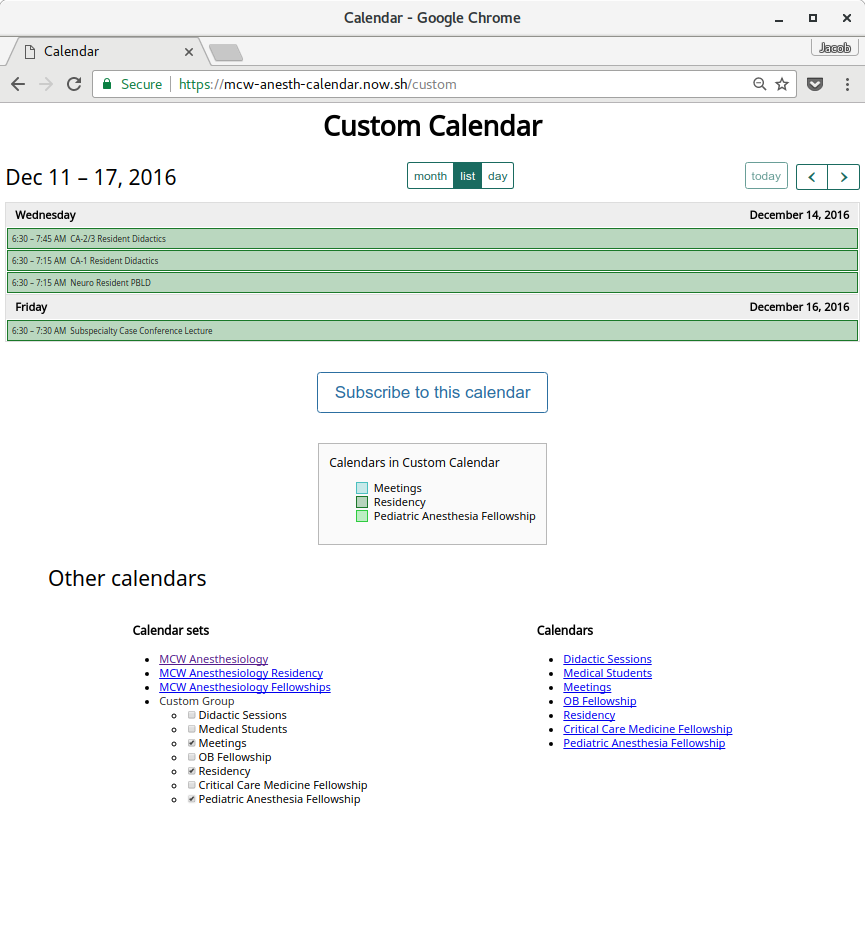

# Calendar merger

Suite of tools to merge multiple external calendars into a single view or a single file for importing.

## Components

### Package

`dist/ical-merger*.js`

Default export is a relatively simple function that merges multiple .ics files into one.

```javascript
merge(inputs, options);
```

```javascript
icals = [
	fs.readFileSync('cal.ics', 'utf8'),
	fs.readFileSync('another.ics', 'utf8')
];
merge(icals, {
	calname: 'Merged Calendar',
	timezone: 'America/Chicago',
	caldesc: 'Two calendars put together'
})
```

Calendar name, description, and timezone default to their respective values in the first calendar encountered (`inputs[0]`);

### CLI tool

`cli.js`

A small wrapper for the underlying package.

```sh
ical-merge <filenames...>
```

```sh
CALNAME="Merged Calendar"\
TIMEZONE="America/Chicago"\
CALDESC="Two calendars put together"\
ical-merge cal.ics another.ics
```

Accepts filenames, options are set by environment variables. Output is sent to stdout.

### Web service

`dist/server.js`

Web service that serves the calendar webapp and serves merged .ics files.

`/combine.ics` accepts an array of URLs to externally-hosted .ics files, and responds with the merged file. URLs are specified with PHP-style array syntax: `?urls[]=…`.

Other `/[ID].ics` merged files are returned, based on the [`.env.json`][env] configuration file.

### Webapp

`public/**/*`

Webapp that displays public calendars from Google Calendar in a single view. Uses [FullCalendar][fullcalendar] heavily.



## Requirements

### `.env.json`

The web service and the webapp require configuration via `.env.json` in the project's root

```json
{
	"GOOGLE_CALENDAR_API_KEY": "[API KEY]",
	"GOOGLE_ANALYTICS_TRACKING_ID": "[ID]",
	"calendars": {
		"cal1": {
			"calname": "Calendar 1",
			"caldesc": "Calendar 1 desc",
			"timezone": "America/Chicago",
			"color": "#462aa3",
			"googleCalendarId": "[ID]@group.calendar.google.com",
			"url": "https://calendar.google.com/calendar/ical/[ID]%40group.calendar.google.com/public/basic.ics"
		},
		"cal2": {
			"calname": "Calendar 2",
			"caldesc": "Calendar 2 desc",
			"timezone": "America/Chicago",
			"color": "#001f3f",
			"subCalendars": [
				{
					"calname": "Subcalendar 1",
					"caldesc": "Subcalendar 1 desc",
					"timezone": "America/Chicago",
					"color": "#0074D9",
					"googleCalendarId": "[ID]@group.calendar.google.com",
					"url": "https://calendar.google.com/calendar/ical/[ID]%40group.calendar.google.com/public/basic.ics"
				},
				{
					"calname": "Subcalendar 2",
					"caldesc": "Subcalendar 2 desc",
					"timezone": "America/Chicago",
					"color": "#7FDBFF",
					"googleCalendarId": "[ID]@group.calendar.google.com",
					"url": "https://calendar.google.com/calendar/ical/[ID]%40group.calendar.google.com/public/basic.ics"
				}
			]
		}
	},
	"calendarGroups": {
		"basic": {
			"calname": "Group Name",
			"caldesc": "Main calendar group",
			"timezone": "America/Chicago",
			"color": "#36a2eb",
			"calendars": [
				"cal1",
				"cal2"
			]
		}
	},
	"combine": {
		"calname": "Combined Calendar",
		"caldesc": "Combined calendar desc",
		"timezone": "America/Chicago"
	}
}
```
Webapp uses `googleCalendarId`s, web service uses `url`s.


[FullCalendar instructions for Google Calendar API key and calendar IDs][fullcalendar-gcal]

## Docker
### Build
To build the Docker-container run:

`docker build . -t ics-merger`

### Run
To run the tool in a Docker-container build it first then run:

`docker run -p 80:3000 -d -v ./.env.json:/ics-merger/.env.json:ro isc-merger`

[env]: #envjson
[fullcalendar]: https://fullcalendar.io
[fullcalendar-gcal]: https://fullcalendar.io/docs/google_calendar/
